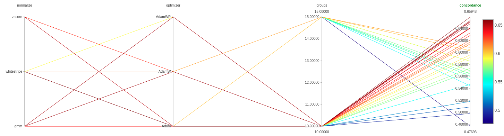
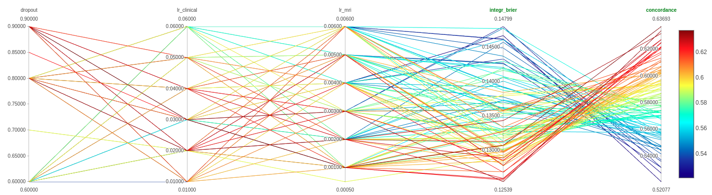

<h1>Introduction</h1>
Trains ResNet or simple CNN on input 3D MRIs to predict survival. FCNN model trains model on clinical variables dataset to predict survival. 

Implementations:
- Logging to file
- MLflow to track hyperparameter tuning

The 3D ResNet model expects the following folder structure (patient id is made up):

```
├── data
│   ├── pickles_jsons
│   │   ├── filter_ids_v2_all.pkl
│   │   ├── filter_ids_v2.pkl
│   │   ├── ids_per_phase.pkl
│   │   ├── id_surv_mapping_10_groups.json
│   ├── preoperative_no_norm
│   │   ├── BMIAXNAT_43545
│   │   │   ├── ENT
│   │   │   │   └── BMIAXNAT_E04353_1_ENT.nii.gz
│   │   │   ├── FLR
│   │   │   │   └── BMIAXNAT_E04353_4_FLR.nii.gz
│   │   │   ├── T1c
│   │   │   │   └── BMIAXNAT_E04353_10_T1c.nii.gz
│   │   │   ├── T1w
│   │   │   │   └── BMIAXNAT_E04353_6_T1w.nii.gz
│   │   │   └── T2w
│   │   │       └── BMIAXNAT_E04353_5_T2w.nii.gz
```

<h1>How to</h1>

Run `ResNet_Final.ipynb` to train the Logistic-Hazard 3D ResNet model on preoperative images. `ResNet_final_vanilla_pytorch.ipynb` is the vanilla PyTorch implementation. Provides much more customizability. The PyCox library heavily relies on the Torchtuples module, limiting the customizability. We wrote an implementation that only uses the Logistic-Hazard loss function and the transformation of the outputs of an NN to hazard rates. Lets call it the method "without Torchtuples". Run `/fcnn_model/survival_analysis_pycox.ipynb` to train the FCNN model. Run `Featuremaps_visualization.ipynb` after training the (non Torchtuples version) 3D ResNet model and saving the weights of the trained model to visualize the learned features of the model. Run `ResNet_final_with_postop.ipynb` to train the Logistic-Hazard 3D ResNet model with both preoperative and postoperative images.


The `Docker` folder contains a CUDA enabled implementation of a Jupyterlab container. 
The `descriptives` folder contains a Python notebook that was used to show some descriptives 
of the clinical dataset. The `modules` folder contains the various code used to implement various 
aspects of the models. `/modules/resnet_3d.py` contains the 3D ResNet model. `/modules/ensemble_model.py` contains the ensemble model (FCNN + 3D ResNet). `/modules/dataset.py` contains the PyTorch dataset class that handles data preprocessing on the fly (bounding box creation, augmentations etc). `/modules/dataset_images_only.py` is the dataset class for the test dataset. `/modules/normalization.py` contains the normalization scripts (Zscore, whitestripe etc). `/modules/utils.py` contains various helper functions. `/modules/mapper.py` contains the script that creates the input for the PyTorch dataset class. It specifies for every patient where the sequences are located, what the survival time is, if they died and in what discrete time interval they are categorized. The `preprocessing_scripts` folder contains some preprocessing scripts such as moving the MRI files from one location to another. The `id_surv_mapping` notebook is used to generate a mapping between a patient ID and the corresponding survival time, discrete time group  and event. The resulting file is necessary for the mapper. 

<h2>Hyper parameter tuning</h2>

`run_tune.sh` runs hyperparameter tuning based on a for loop 
that executes train_resnet.py with various parameters. 
This is done with a bash script because of the allocation of CUDA memory. 
PyTorch doesnt release the memory when the Python file/kernel is still running. 
Bash script closes python file after each training run and reopens it on a next one.

`run_tune_ensemble.sh` does the same, but for the ensemble model.

`run_tune_custom.sh` can be used to define your own custom loop.





<h2>Parameters train_resnet</h2>

For help run: `python3 train_resnet.py --h`

`python3 train_resnet.py [-h] [--mri_path p] [--model_depth d] [--groups g] [--batch_size b] [--optimizer o] [--normalization n] [--patience es] [--model_type model_type]`

Runs ResNet or CNN model with Logistic Hazard

```
optional arguments:
  -h, --help            show this help message and exit
  --mri_path p          the path to the stored MRIs
  --model_depth d       Depth of ResNet Model (10, 18, 50)
  --groups g            Number of Logistic groups (10, 15)
  --batch_size b        batch size
  --optimizer o         Optimizer to use (Adam, AdamW, AdamWR)
  --normalization n     Normalization method to use (zscore, whitestripe, gmm)
  --patience es         Patience for EarlyStopping
  --model_type model_type
                        ResNet or CNN

by Assil Jwair
```


<h2>Parameters tuning</h2>

`./run_tune.sh <stopping> <mode>` 

mode = ReNet or CNN \
stopping = integer, defines early stopping


For ensemble model:


`./run_tune_ensemble.sh`


